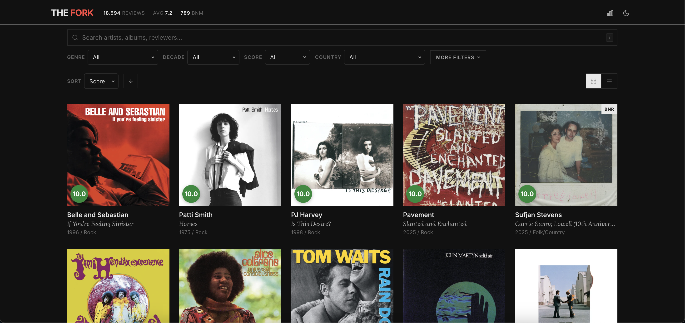

# The Fork

Browse and explore 27,800+ Pitchfork album reviews from 1999–2026 in a fast, filterable interface. Data sourced from Pitchfork (2009–present via sitemap scraping, 1999–2009 via historical archives) and enriched with metadata from MusicBrainz, Wikidata, review text analysis, and LLM-assisted tagging.

**Live**: [the-fork.vercel.app](https://the-fork.vercel.app)



## Features

**Browsing**
- 27,809 album reviews with scores, genres, and cover art
- Grid and list view modes
- Infinite scroll with paginated loading
- Album detail modal with full review info and link to Pitchfork

**Filtering & Search**
- Full-text search across artists, albums, and reviewers
- Filter by genre, decade, year, score range, country, and language
- Sort by score, release date, or review date (ascending/descending)
- Group by genre, year, decade, score range, reviewer, country, language, or BNM status
- URL state sync — filters persist in the URL for sharing
- Keyboard shortcut: `/` to focus search

**Statistics Panel**
- Score distribution histogram
- Top genres breakdown
- Reviews by year timeline
- Quick stats: 9.5+ scores, Best New Music count, reviewer count, median score

**Other**
- Dark/light mode with system preference detection
- Responsive design
- 99.8% country/language coverage via multi-source enrichment
- On-demand release year fetching from Pitchfork for older entries

## Data Pipeline

The dataset is built through a multi-step pipeline:

1. **Scrape** (`scrape-sitemap.js`) — Crawls Pitchfork's sitemap to extract all album review URLs, then scrapes each review page for artist, title, score, genre, BNM/BNR status, reviewer, description, cover art, and release year
2. **Enrich releases** (`enrich.js`) — Looks up each album on MusicBrainz to get country and language metadata for the release
3. **Enrich artists** (`enrich-artists.js`) — Looks up each unique artist on MusicBrainz to get origin country and inferred language
4. **Enrich via Wikidata** (`enrich-wikidata.js`) — Searches Wikidata for remaining unknown artists using P495/P27/P740/P19 claims
5. **Enrich via reviews** (`enrich-reviews.js`) — Context-aware scraper that extracts artist origin from Pitchfork review text (nationality patterns, "based in" phrases, etc.)
6. **Serve** (`serve.js`) — Local Node.js server that serves the static frontend and provides an API endpoint for on-demand release year fetching

## Dataset

| Stat | Value |
|------|-------|
| Total reviews | 27,809 |
| Best New Music | 1,300+ |
| Best New Reissue | 612 |
| Average score | 7.0 |
| Genres | 9 |
| Reviewers | 800+ |
| Date range | 1999–2026 |
| Country coverage | 99.8% |
| Language coverage | 99.8% |

## Run Locally

```bash
npm install
npm run serve
```

Then open [http://localhost:3000](http://localhost:3000).

## Scripts

```bash
npm run serve              # Start local server
npm run scrape:sitemap     # Scrape all reviews from Pitchfork sitemap
npm run enrich             # Enrich albums with MusicBrainz release data
node enrich-artists.js     # Enrich artist-level country/language via MusicBrainz
node enrich-wikidata.js    # Enrich remaining artists via Wikidata API
node enrich-reviews.js     # Extract artist origin from review text
```

## Tech Stack

- **Frontend**: Vanilla JS, HTML, CSS (no framework)
- **Fonts**: Inter + Lora (Google Fonts)
- **Server**: Node.js HTTP server
- **Scraping**: Playwright (headless browser)
- **Enrichment**: MusicBrainz API, Wikidata API, review text NLP, LLM-assisted tagging
- **Data**: Static JSON files (~30MB)

## License

MIT
